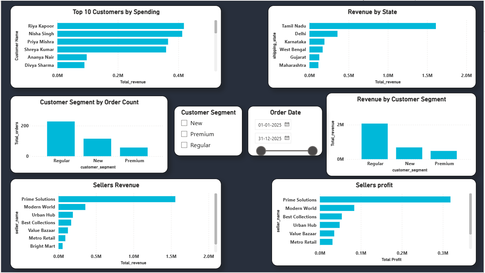

\# 🛒 E-Commerce Data Analytics Project


\## 📌 Project Overview


This project is an end-to-end \*\*E-Commerce Data Analytics\*\* project built using \*\*MySQL, Python, and Power BI\*\*.


The goal of this project is to analyze e-commerce sales, customer behavior, product performance, seller performance, revenue, and profitability to generate meaningful business insights.


\### Data Analytics Workflow


\*\*MySQL → Python → Power BI\*\*


\---


\## 🎯 Business Questions


This project answers questions such as:


\- What is the total revenue and profit?

\- What is the Average Order Value (AOV)?

\- Which categories generate the highest revenue and profit?

\- Which products generate the highest revenue?

\- Which customers spend the most?

\- Which sellers generate the highest revenue and profit?

\- How does revenue change over time?

\- Which customer segments generate the most revenue?

\- Which states generate the highest revenue?

\- Which order statuses contribute the most revenue?


\---


\## 🛠️ Tools \& Technologies


| Tool | Purpose |

|---|---|

| \*\*MySQL\*\* | Data analysis, SQL queries, and analytical views |

| \*\*Python\*\* | Data analysis using Pandas and visualization using Matplotlib |

| \*\*Power BI\*\* | Interactive dashboard and business reporting |

| \*\*GitHub\*\* | Project documentation and version control |


\---


\## 🗄️ Database


The project uses an e-commerce database named \*\*Amazon\*\* containing:


\- Customers

\- Orders

\- Order Items

\- Products

\- Categories

\- Sellers

\- Payments


\---


\## 📊 SQL Analysis


SQL was used to perform:


\- Total revenue analysis

\- Total orders and units sold

\- Average Order Value (AOV)

\- Revenue by category

\- Revenue by state

\- Monthly revenue analysis

\- Top customers by spending

\- Repeat customer analysis

\- Product profitability analysis

\- Category profitability analysis

\- Seller performance analysis

\- Customer segment analysis

\- Month-over-Month revenue growth

\- Top products within each category


\### SQL Views


The project includes the following analytical views:


\- `vw\_monthly\_revenue`

\- `vw\_category\_performance`

\- `vw\_customer\_spending`

\- `vw\_product\_performance`

\- `vw\_seller\_performance`


\---


\## 🐍 Python Analysis


Python was used with \*\*Pandas\*\* and \*\*Matplotlib\*\* for additional analysis.


The analysis includes:


\- Loading data from MySQL

\- Data quality checks

\- Missing-value checks

\- Duplicate checks

\- Monthly revenue analysis

\- Category performance analysis

\- Revenue sorting and ranking

\- Data visualization


\---


\## 📈 Power BI Dashboard


The Power BI dashboard contains \*\*3 pages\*\*.


\### Page 1 — Executive Overview


\- Total Revenue

\- Total Orders

\- Total Units Sold

\- Total Profit

\- Average Order Value

\- Monthly Revenue Trend

\- Revenue by Category

\- Revenue by Order Status


\### Page 2 — Product \& Category Analysis


\- Profit by Category

\- Top 10 Products by Revenue

\- Top 10 Products by Profit

\- Profit Margin by Category


\### Page 3 — Customer \& Seller Analysis


\- Top 10 Customers by Spending

\- Revenue by Customer Segment

\- Top 10 Sellers by Revenue

\- Top 10 Sellers by Profit

\- Customer Segment by Order Count

\- Revenue by State


\---


\## 📂 Project Structure


```text

Ecommerce\_Data\_Analytics/

│

├── SQL/

│   ├── ecommerce\_analysis.sql

│   └── views.sql

│

├── Python/

│   └── ecommerce\_analysis.py

│

├── PowerBI/

│   └── Amazon Project\_2.pbix

│

├── Screenshots/

│   └── Dashboard screenshots

│

└── README.md


🔐 Security


Database credentials and sensitive information are not included in this repository.


Environment files such as .env are excluded to protect database credentials.


📸 Dashboard Preview


### 1. Executive Overview



### 2. Product & Category Analysis


### 3. Customer & Seller Analysis


🚀 Skills Demonstrated

SQL

MySQL

Joins

Subqueries

CTEs

Window Functions

Aggregations

Data Cleaning

Python

Pandas

Matplotlib

Power BI

DAX

Data Modeling

Business Analysis

Data Visualization


👨‍💻 Author


Sanjay S


Aspiring Data Analyst


Skills: SQL | Python | Power BI | Excel

